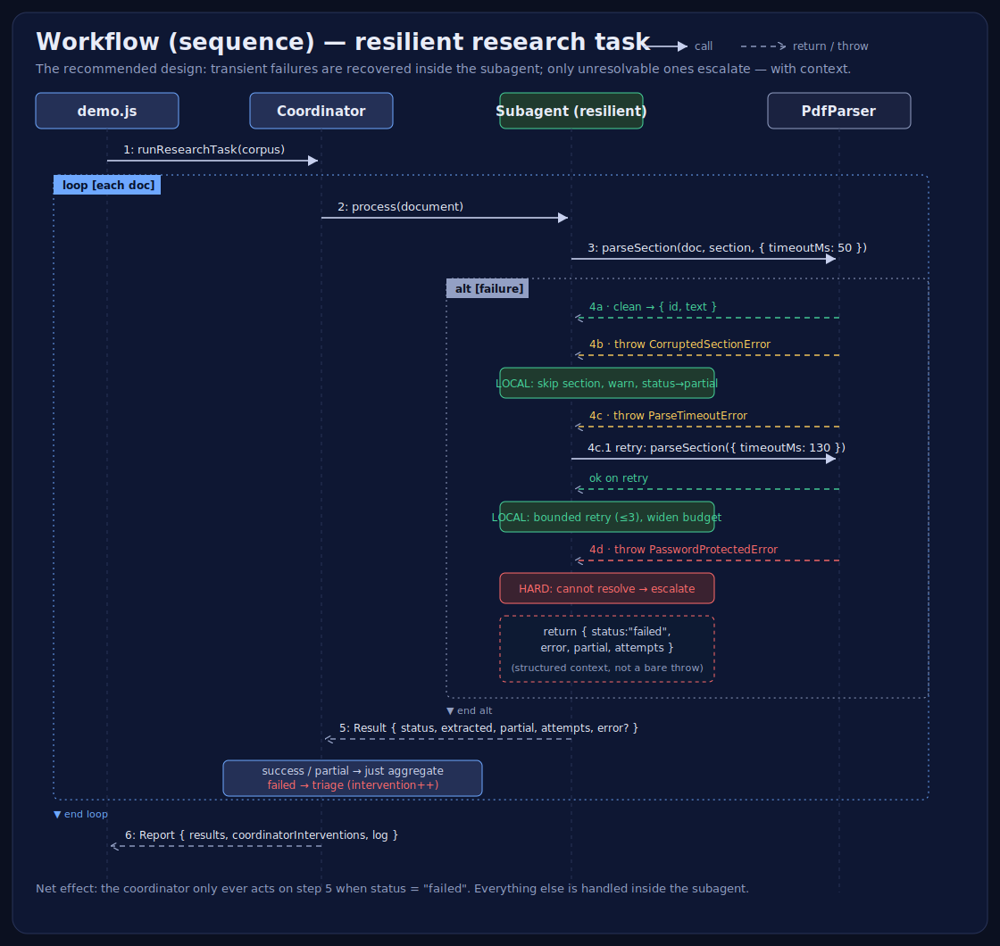

# error-coordination-sub-agents

> A demo of the right way to handle failures between a **coordinator** and its **subagents**:
> **local recovery for transient failures; escalate only what can't be resolved — with context.**

## The question this project demonstrates

> The document analysis subagent frequently encounters failures when processing PDF
> files — corrupted sections, password-protected files, and parse timeouts on large files.
> Today any exception terminates the subagent and forces the coordinator to decide whether
> to retry, skip, or fail the whole task. This causes **excessive coordinator involvement
> in routine error handling.** What's the most effective architectural improvement?

### ✅ The answer

**Have the subagent implement local recovery for transient failures and only propagate
errors it cannot resolve to the coordinator — including what was attempted and any partial
results obtained.**

To keep the coordinator from being bottlenecked by routine execution issues, subagents
should be **robust and self-contained**. Local error handling + graceful degradation lets
the subagent resolve transient issues itself. When it hits a genuinely unresolvable failure
(e.g. hard password protection) it bubbles up **structured error context** along with
**partial successes** — minimizing coordinator overhead while preserving visibility.

## Run the Node demo

```bash
node demo.js            # run both scenarios and compare
node demo.js --naive    # only the "before" (every exception escalates)
node demo.js --resilient# only the "after" (local recovery + structured escalation)
```

Expected contrast over the same 4-document corpus:

| Scenario | success | partial (self-recovered) | failed (escalated) | Coordinator interventions |
|----------|--------:|-------------------------:|-------------------:|--------------------------:|
| Naive subagent     | 1 | 0 | 3 | **3** |
| Resilient subagent | 2 | 1 | 1 | **1** |

The resilient subagent recovers the corrupted-section and timeout cases **locally** and only
escalates the password-protected document — with an attempt log and any partials.

## Open the interactive pages

```bash
open index.html          # interactive visual explanation + simulator
open prompt_builder.html # Claude AI Architect interactive prompt generator
```

A self-contained in-browser simulator (`index.html`) runs the same task two ways and animates the
coordinator-intervention counter (the metric for "how much routine work the coordinator is
being forced to handle"). Additionally, `prompt_builder.html` provides a dynamic UI to generate
master AI prompts for creating new Claude AI Architect exam projects from scratch.

### ⚡ Automated Startup (`agy` Login Routine)

When logging into or starting an Antigravity CLI (`agy`) session in this workspace, project rules
in `.agents/AGENTS.md` automatically launch the local dev server and open the pages inside the **Wave**
browser. You can also trigger this routine manually at any time:

```bash
./agy_login.sh           # starts dev server (port 8888) & launches Wave browser
npm run wave             # opens localhost pages in Wave browser
```

## Project layout

```
demo.js                       # CLI demo — naive vs resilient, side by side
index.html                    # interactive visual explanation + simulator
prompt_builder.html           # interactive prompt builder for new exam demos
init_prompt.md                # master AI initialization prompt template
agy_login.sh                  # automated startup script for agy login & Wave launch
.agents/AGENTS.md             # workspace rules automating startup on agy session login
docs/
  uml-class.svg               # class diagram (static structure & relationships)
  uml-workflow.svg            # sequence diagram (runtime workflow)
src/
  document.js                 # simulated PDF model + sample corpus (3 failure modes)
  pdf-parser.js               # simulated parser: CorruptedSection / Password / Timeout errors
  subagent-naive.js           # ❌ anti-pattern: no local handling, every exception escalates
  subagent-resilient.js       # ✅ the answer: local recovery + structured escalation
  coordinator.js              # orchestrator — only triages genuine escalations
  sleep.js
```

## How the `src/` fits together

There are six modules. They form a clean dependency chain — **domain model → parser →
subagent (contract + two implementations) → coordinator → entry point** — with no
import cycles.

### The modules

| File | Role | What it does |
|------|------|---------------|
| **`document.js`** | Domain model | Defines `PdfSection` and `PdfDocument`, plus the `sampleCorpus()` factory that returns 4 documents exercising every failure mode (clean, corrupted section, password-protected, large-file timeout). Carries **no behaviour** — just data and the failure flags. |
| **`pdf-parser.js`** | Simulated I/O | A stand-in for a real PDF library. Its key design choice: it throws **typed errors tagged with `recoverable`** — `CorruptedSectionError` (✅), `ParseTimeoutError` (✅), `PasswordProtectedError` (❌). That flag is what lets a smart caller branch on recoverability instead of guessing. Exposes an all-or-nothing `parseDocument()` and a per-section `parseSection({ timeoutMs })`. |
| **`subagent-naive.js`** | ❌ Anti-pattern | Calls `parseDocument()` once and does **zero** error handling. Any exception terminates it and bubbles straight to the coordinator with no partials and no context — the thing the question complains about. |
| **`subagent-resilient.js`** | ✅ The answer | Implements **local recovery**: catches each typed error and acts — skip+degrade on corrupted sections, bounded retry (≤3, widening the time budget) on timeouts — and only escalates the genuinely unresolvable case (password). When it escalates, it returns a **structured result** (`status`, `extracted`, `partial`, `attempts`, `error`) instead of a bare throw. |
| **`coordinator.js`** | Orchestrator | Iterates the corpus and delegates each document to a subagent. Crucially, its workload depends on the subagent: with the naive one it must `try/catch` every call and decide retry/skip/fail (3 interventions); with the resilient one it only reacts to `status === "failed"` (1 intervention) and otherwise just aggregates. |
| **`sleep.js`** | Utility | A one-liner `sleep(ms)` helper used to simulate parsing latency. |

### How they're related

- **One contract, two implementations.** `NaiveDocumentSubagent` and
  `ResilientDocumentSubagent` both expose `async process(document) → Result`. The
  `Coordinator` is coded against that **shape** (duck-typed interface), so you can swap
  implementations without touching the coordinator.
- **The parser's typed errors are the seam.** The resilient subagent `instanceof`-checks
  each error class to decide recover/escalate. The naive subagent ignores them — which is
  exactly why it over-escalates.
- **`Result` is the escalation contract.** Instead of throwing, a resilient subagent always
  *returns* `{ status, extracted, partial, warnings, attempts, error? }`. The `error?`
  field only appears on `status: "failed"`, and it always carries `recoverable` plus
  `attemptedLocally` — so the coordinator gets context, not a stack trace.
- **No cycles.** `document.js` ← `pdf-parser.js` ← `subagent-*.js` ← `coordinator.js` ←
  `demo.js`. Each layer only imports the layer below it.

### Class diagram


### Workflow (sequence diagram)



### The end-to-end workflow

1. **Entry** — `demo.js` builds a `Coordinator` with either a `NaiveDocumentSubagent` or a
   `ResilientDocumentSubagent`, gets the corpus from `sampleCorpus()`, and calls
   `runResearchTask(corpus)`.
2. **Loop** — the coordinator iterates the documents and, for each one, calls
   `subagent.process(document)`.
3. **Parse** — the subagent calls `PdfParser.parseSection(...)` per section.
4. **Triage by failure type (the heart of the design):**
   - **clean** → collect the section.
   - **`CorruptedSectionError`** (transient) → handled **locally**: skip the section, keep
     the rest, mark the document `partial`. The coordinator never hears about it.
   - **`ParseTimeoutError`** (transient) → handled **locally**: retry up to 3 times with a
     wider budget; escalate only if all retries fail.
   - **`PasswordProtectedError`** (hard) → **escalated**, but as a structured result with
     `error.recoverable = false`, the `attempts` log, and any partials.
5. **Return** — the subagent returns one `Result` per document.
6. **Aggregate** — the coordinator adds an intervention to its counter **only** for
   `status: "failed"`; `success`/`partial` are just aggregated.
7. **Report** — the coordinator returns `{ results, coordinatorInterventions, log }` to
   `demo.js`, which prints the naive-vs-resilient contrast (3 → 1 interventions).

> Net effect: the coordinator stops being a bottleneck for routine error handling. It only
> ever has to reason about genuinely unresolvable problems — and even then it receives
> context, not a bare exception.

## Key idea in one snippet

```js
// subagent-resilient.js: transient → fix locally; hard → escalate WITH context
if (err instanceof CorruptedSectionError) {
  warnings.push(`Skipped corrupted section ${section.id}; continuing.`);
  partial.push({ id: section.id, reason: "corrupted" });
  break;                          // graceful degradation, no escalation
}
if (err instanceof ParseTimeoutError && attempt < MAX_RETRIES) {
  budgetMs += 80;                 // local recovery: widen budget and retry
  continue;
}
// ... only password protection (unresolvable locally) reaches the coordinator,
//     returned as { status: "failed", error: {...}, partial: [...], attempts: [...] }
```
